# 🔗 Serverless-URL-Shortener-with-Real-Time-Analytics


> A production-ready serverless URL shortener with real-time analytics, expiry links, and security — built entirely on AWS Free Tier.

🌐 **Live Demo:** [https://d2az4azijd393i.cloudfront.net](https://d2az4azijd393i.cloudfront.net)

---

## 📌 Table of Contents

- [Overview](#overview)
- [Features](#features)
- [Architecture](#architecture)
- [AWS Services Used](#aws-services-used)
- [Screenshots](#screenshots)
- [API Endpoints](#api-endpoints)
- [Security](#security)
- [Project Structure](#project-structure)
- [Team](#team)

---

## 📖 Overview

Serverless-URL-Shortener-with-Real-Time-Analytics is a cloud-native URL shortening platform built using AWS serverless architecture. Users can shorten long URLs, set expiry durations, and track real-time click analytics — all through a clean, responsive web dashboard served over HTTPS via CloudFront.

The entire system runs without a single server, scaling automatically and operating within the AWS Free Tier.

---

## ✨ Features

- ⚡ **Instant URL Shortening** — Generate short links in milliseconds
- 🎯 **Custom Short Codes** — Choose your own short code (e.g. `/my-link`)
- ⏰ **Expiry Links** — Set links to auto-expire after 1–365 days via DynamoDB TTL
- 📊 **Real-Time Analytics** — Track click counts, timestamps, IP addresses, and user agents
- 🔒 **Secure by Design** — IAM least privilege, API throttling, HTTPS enforcement
- 📈 **CloudWatch Monitoring** — Live dashboards, error alarms, and SNS email alerts
- 🌍 **Global CDN** — CloudFront delivers the frontend over HTTPS from edge locations

---

## 🏗️ Architecture

```
User Browser
      |
      v
CloudFront (HTTPS CDN + Edge Caching)
      |
      v
S3 Bucket (Frontend HTML Dashboard)
      | (API Calls)
      v
API Gateway (REST API — 4 Endpoints)
      |
      v
AWS Lambda Functions
┌─────────────┬──────────────┬─────────────────┐
│ url-shorten │ url-redirect │  url-analytics  │
└─────────────┴──────────────┴─────────────────┘
      |                              |
      v                              v
DynamoDB Tables              CloudWatch Logs
(url-mappings)               Alarms + Dashboard
(url-analytics)                      |
                                     v
                              SNS Email Alerts
```

---

## ☁️ AWS Services Used

| Service | Purpose |
|---|---|
| **AWS Lambda** | Backend logic — URL shortening, redirect, analytics (Python 3.12) |
| **Amazon API Gateway** | REST API exposing Lambda functions to the frontend |
| **Amazon DynamoDB** | NoSQL database — stores URL mappings and click events |
| **Amazon S3** | Hosts the frontend HTML dashboard |
| **Amazon CloudFront** | HTTPS CDN in front of S3 for fast, secure delivery |
| **Amazon CloudWatch** | Logs, metrics, dashboards, and error alarms |
| **AWS IAM** | Role-based access control with least privilege |
| **Amazon SNS** | Email notifications when CloudWatch alarms trigger |

---

## 📸 Screenshots

### Dashboard — Shorten URL
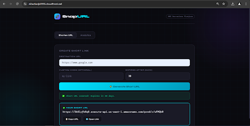

### Analytics Tab
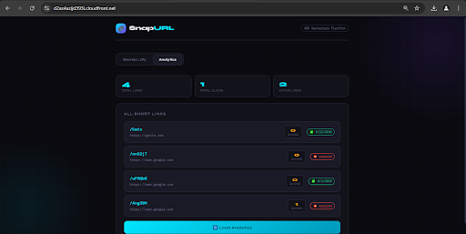

### CloudFront Distribution
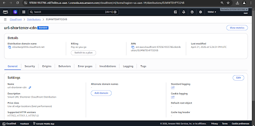

### Lambda Functions
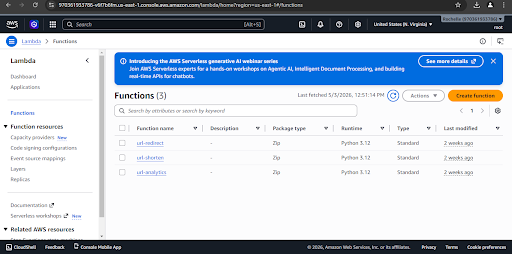

### API Gateway Resources
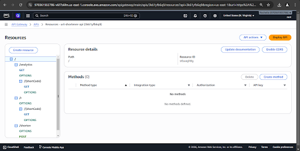

### DynamoDB — URL Mappings Table
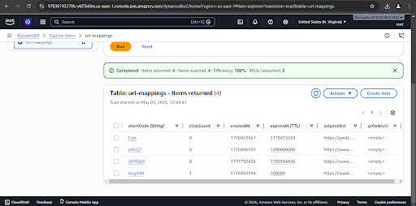

### DynamoDB — Analytics Table
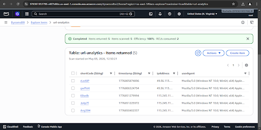

### S3 Bucket
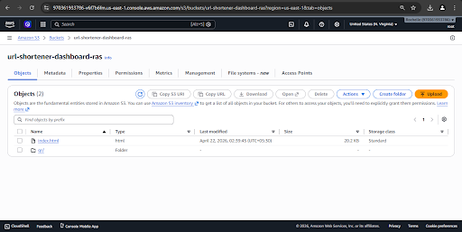

### CloudWatch Overview
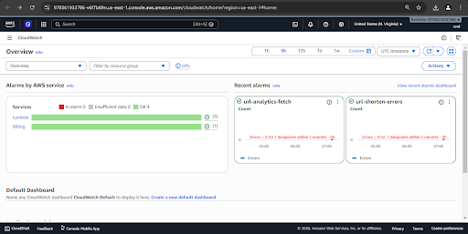

### SNS Billing Alert
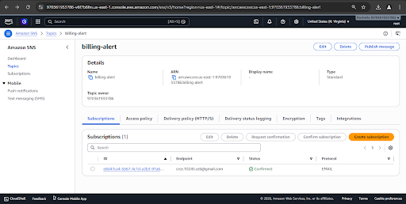

### IAM — Lambda Role
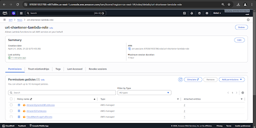

### IAM — Admin User
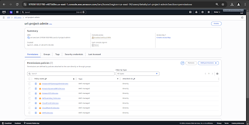

---

## 🔌 API Endpoints

Base URL: `https://3k61yfb6q9.execute-api.us-east-1.amazonaws.com/prod`

| Method | Endpoint | Description |
|---|---|---|
| `POST` | `/shorten` | Create a new short URL |
| `GET` | `/r/{shortCode}` | Redirect to original URL + log click |
| `GET` | `/analytics` | Fetch all URLs with click stats |
| `GET` | `/analytics/{shortCode}` | Fetch click history for one URL |

### Sample Request — Shorten URL
```json
POST /shorten
{
  "url": "https://www.example.com/very/long/url",
  "customCode": "my-link",
  "expiryDays": 30
}
```

### Sample Response
```json
{
  "shortCode": "my-link",
  "shortUrl": "https://3k61yfb6q9.execute-api.us-east-1.amazonaws.com/prod/r/my-link",
  "originalUrl": "https://www.example.com/very/long/url",
  "expiresAt": 1750000000
}
```

---

## 🔐 Security

| Layer | Implementation |
|---|---|
| IAM Least Privilege | Lambda role has only DynamoDB, S3, CloudWatch access |
| API Throttling | 100 req/sec rate, 200 burst limit on API Gateway |
| HTTPS Only | CloudFront enforces HTTP → HTTPS redirect |
| S3 Bucket Policy | Public read only — no write/delete from public |
| Input Validation | URL format check, empty input check, duplicate code check |
| DynamoDB PITR | Point-in-time recovery enabled — 35 day retention |
| CloudWatch Alarms | Error alarms on all 3 Lambda functions |
| Billing Protection | Zero-spend budget + $5 billing alarm via SNS |

---

## 📁 Project Structure

```
Serverless-URL-Shortener-with-Real-Time-Analytics/
│
├── README.md
│
├── lambda/
│   ├── url-shorten.py
│   ├── url-redirect.py
│   └── url-analytics.py
│
├── frontend/
│   └── index.html
│
├── screenshots/
   ├── shortnerpng.png
   ├── analytics.png
   ├── dashboard.png
   ├── lambda.png
   ├── API_gateway.png
   ├── dynamodb-url-shortner.png
   ├── dynamodb-url-analytics.png
   ├── S3.png
   ├── cloudwatch.png
   ├── billing_alert.png
   ├── IAM_Roles.png
   └── IAM_Users.png

```

> Built with ❤️ on AWS Free Tier
